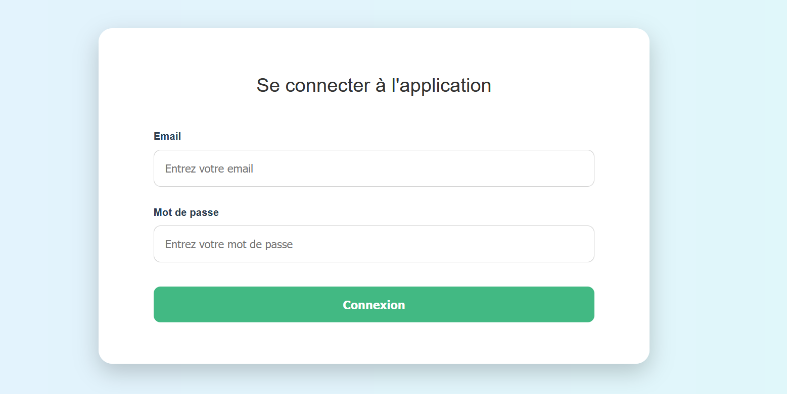
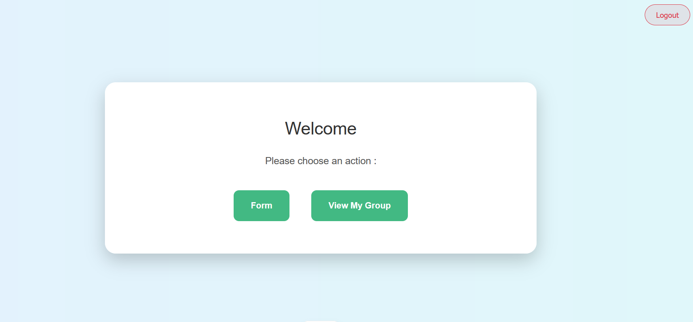
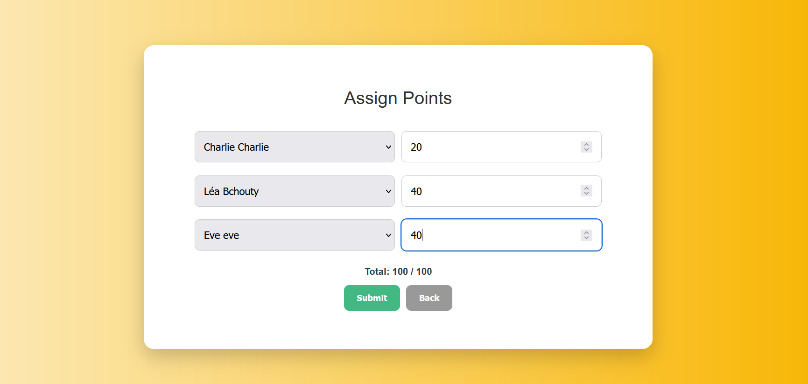
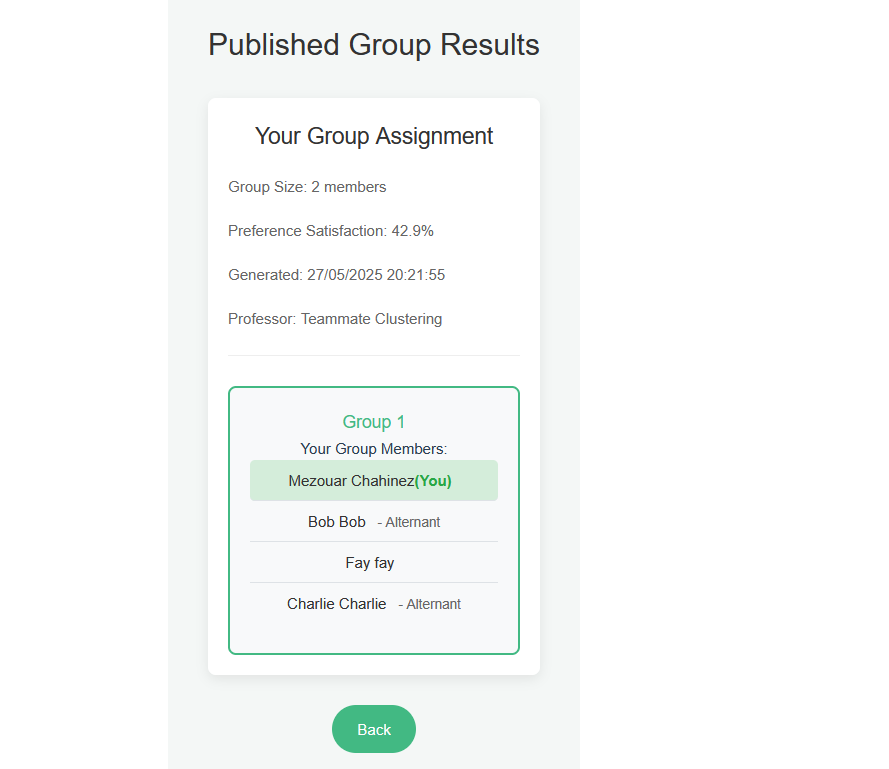
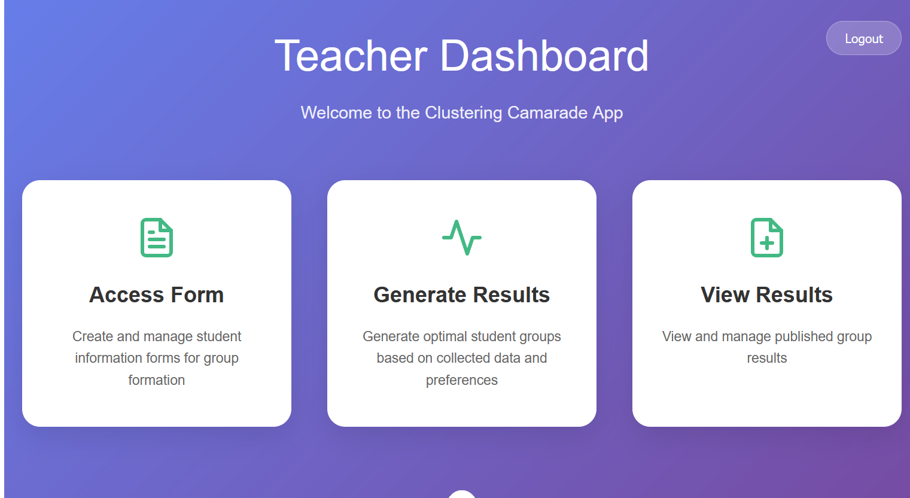
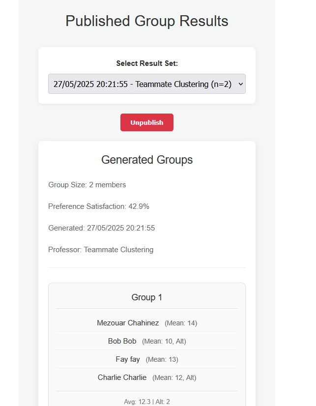
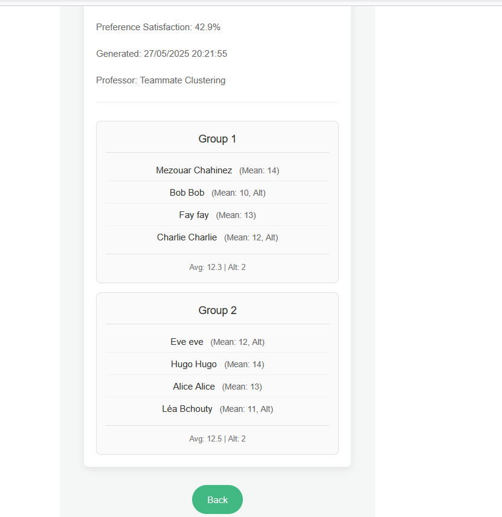

# Guide d'utilisation 
## Sommaire : 
1. Introduction
2. Installation de l’application
3. Présentation des rôles utilisateurs
4. Utilisation de l’application
5. Conclusion

### 1. Introduction 

Ce guide d’utilisation a pour objectif de vous accompagner dans la prise en main de notre application de gestion de préférences et de formation de groupes étudiants. Il détaille les étapes nécessaires à l’installation, explique les rôles utilisateurs (enseignant et étudiant), et décrit le fonctionnement des principales fonctionnalités de l’interface. Que vous soyez développeur, enseignant ou étudiant, ce document vous aidera à naviguer efficacement dans l'application.

### 2. Installation de l’application

#### 2.1 Configuration préalable

Avant d’installer l’application, il est nécessaire de configurer la base de données.
Nous utilisons Supabase comme service de base de données.
 Voici les étapes à suivre :
1. Créer un compte Supabase, si ce n’est pas déjà fait.
2. Créer un nouveau projet Supabase.
4. Importer le fichier bdd.sql pour initialiser la structure de la base de données.
6. Insérer les données des étudiants et des enseignants, car nous considérons qu’ils sont déjà inscrits dans le système.

Une fois la base de données configurée, vous pouvez installer l’application en suivant ces étapes :

Téléchargez l’application depuis ce lien : [https://github.com/leabchouty/Box-Certificative-Finale].

Décompressez l’archive puis ouvrez le dossier dans Visual Studio Code (VS Code).

- Pour lancer le frontend :

Ouvrez un terminal dans VS Code.

Accédez au dossier front avec la commande : cd front
Installez les dépendances avec : npm install
Puis lancez l’application en exécutant : npm run dev

- Pour lancer le backend :

Ouvrez un second terminal .

Accédez au dossier back : cd back
Installez les dépendances Python avec : pip install -r requirements.txt
Lancez ensuite le serveur avec : py run.py

### 3. Présentation des rôles utilisateurs
L’application comporte deux rôles principaux : un pour les étudiants et un autre pour les enseignants.
Les comptes sont déjà créés dans la base de données. Pour différencier un étudiant d’un enseignant, on récupère l’adresse e-mail lors de la connexion, puis on la compare aux e-mails enregistrés dans la base, qui se trouvent dans deux tables distinctes : une pour les professeurs et une pour les étudiants. Selon le rôle déterminé, on redirige l’utilisateur vers sa page.

Le compte étudiant permet de se connecter et offre un menu avec deux options : remplir un formulaire (Form)ou consulter les résultats(Results).
Dans la page formulaire, l’étudiant voit une liste d’étudiants parmi lesquels il doit choisir. Il doit attribuer des points de préférence à chaque étudiant sélectionné. Si la somme des points n’atteint pas 100, une nouvelle liste s’affiche pour continuer à choisir des étudiants jusqu’à ce que le total fasse 100 points, que ce soit réparti entre plusieurs étudiants ou attribué à un seul. Ensuite, l’étudiant peut consulter ses résultats pour savoir dans quel groupe il a été placé.

Après connexion, les enseignants ont accès à plusieurs pages : une page de gestion des formulaires qui comprend un champ pour définir une date limite, un compteur affichant le nombre d’étudiants ayant répondu, un bouton pour fermer la session, ainsi qu’une case à cocher pour publier le formulaire ; une autre page permet de générer les résultats en précisant le nombre d’étudiants par groupe (paramètre n) ; enfin, une dernière page offre la possibilité de visualiser tous les groupes formés.

### 4. Utilisation de l’application

Dans cette image, on voit une page de connexion où l'utilisateur peut se connecter en utilisant son adresse e-mail et son mot de passe.

- Interfaces pour le compte étudiant :

Cette image représente la page d'accueil du compte étudiant. Elle comporte un menu avec deux boutons : l'un pour accéder au formulaire et l'autre pour consulter les résultats.

- Interfaces pour le compte enseignant 

Cette image présente la page d'accueil de l'enseignant. Elle comporte trois boutons : l'un pour créer le formulaire destiné aux étudiants, un autre pour générer les résultats, et un dernier pour consulter les résultats. 

Cette image illustre l’interface de configuration utilisée par l’enseignant. Elle lui permet de créer le formulaire, de saisir ou modifier la date limite, de consulter le nombre d’étudiants ayant validé le formulaire, de publier ce dernier, ainsi que de clôturer la session.

Cette image met en évidence la fonctionnalité principale : la création de groupes en fonction des préférences des étudiants. Elle inclut un champ permettant de définir le nombre d’étudiants par groupe, la possibilité de cocher ou décocher les étudiants (pour exclure les absents), ainsi qu’un bouton pour générer les groupes.

### 5. Conclusion
Ce guide vous a présenté les étapes essentielles pour utiliser l'application de manière simple et efficace. Que vous soyez enseignant ou étudiant, l’objectif est de vous offrir un outil pratique pour gérer les préférences et former des groupes de façon claire et rapide. 

